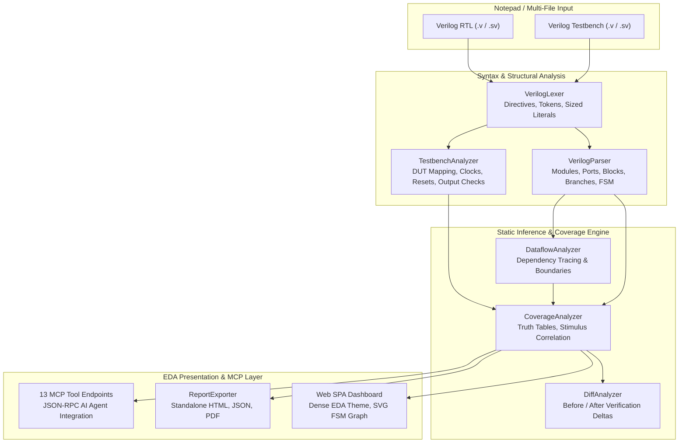

# URG Report for RTL Code

> **Pre-Simulation RTL Coverage Analysis Engine**  
> *Catch verification gaps, missing stimulus, and unreached states in seconds — before running full simulation.*

---

## 💡 The Problem It Solves

In modern digital VLSI design, students and verification engineers typically write RTL, compose a testbench, compile in a heavy simulator (like Synopsys VCS, Cadence Xcelium, or Siemens Questa), run millions of cycles, and invoke coverage report tools (like Synopsys URG) to see what was missed.

**Why wait hours for full simulation + URG just to discover obvious verification gaps?**

**URG Report for RTL Code** analyzes your Verilog RTL and testbench **statically before simulation**:
- Identifies unexercised branches, unreached FSM states, and un-toggled ports in milliseconds.
- Detects whether testbenches verify outputs (`assert(...)`, `if (out != exp)`) or merely print them.
- Decomposes compound conditions into truth-table combinations and boundary checks.
- Provides immediate, actionable guidance with exact file lines and suggested testbench stimulus snippets.

---

## ⚡ Key Features

- **Pre-Simulation Static Analysis Engine:** Fast deterministic AST parsing and static dataflow tracking without waveform simulation or external AI API calls.
- **Multi-File RTL Support & Hierarchy Navigation:** Multi-tab RTL notepad supporting submodules, instantiated module tree navigation, and top-module detection.
- **Smart FSM Reachability & Interactive SVG Graph:** Automatically maps FSM state registers, extracts state encoding, tracks reset reachability, and renders an interactive SVG state transition diagram.
- **Compound Condition & Boundary Value Decomposition:** Analyzes compound boolean expressions (`&&`, `||`, ternary `?:`), truth tables, and numeric boundary thresholds.
- **Output Observation & Assertion Checking:** Evaluates whether DUT outputs are compared in assertions, compound `if` checks (`if (y !== exp_y || carry !== exp_c)`), or only observed in `$display`.
- **Before / After Verification Diff Tracking:** Compares sequential testbench runs in real-time, displaying coverage score deltas, resolved gaps, and newly introduced gaps.
- **Synopsys URG-Style Reports:** Dense, professional semiconductor EDA visual identity with printable standalone HTML, JSON, and PDF report exports.
- **13 Built-in EDA MCP Tools:** Complete Model Context Protocol (MCP) server endpoints allowing AI agents to inspect RTL ASTs, trace dataflow, query gaps, and evaluate stimulus reachability.

---

## 🏗️ Architecture



---

## 📊 Coverage Metrics Summary

| Metric | Pre-Simulation Static Meaning |
| :--- | :--- |
| **SCORE** | Weighted average of applicable metrics (*excludes `N/A` categories*). |
| **LINE** | Executable RTL lines correlated with static testbench stimulus vectors. |
| **COND** | Analysis of boolean conditions and whether truth-table outcomes appear exercised. (*`N/A` if no conditions exist*). |
| **TOGGLE** | Static analysis of port assignments evaluating 0→1 and 1→0 toggle capabilities. |
| **FSM** | State reachability from reset and stimulated state transitions. (*`N/A` if no FSM detected*). |
| **BRANCH** | Analysis of `if`/`else` and `case` branches reaching active stimulus. |

---

## 🚀 Quick Start (Local Run)

### 1. Prerequisites
- Python 3.10+ (tested on Python 3.10, 3.11, 3.12, 3.13, 3.14)

### 2. Installation
```bash
git clone https://github.com/pranavanil34/urg-report-for-rtl.git
cd urg-report-for-rtl

# Install dependencies
pip install -r requirements.txt
```

### 3. Launch the Server
```bash
python main.py
```
Or on Windows:
```cmd
start.bat
```

Open your browser to:
```
http://localhost:8000
```

---

## 🌐 Production Deployment

### Docker Deployment
```bash
docker build -t urg-report-for-rtl .
docker run -p 8000:8000 urg-report-for-rtl
```

### Cloud Platforms (Render, Railway, Fly.io, Heroku)
The repository includes `Dockerfile`, `Procfile`, and `render.yaml` for 1-click cloud deployments.
Set environment variables:
```bash
PORT=8000
HOST=0.0.0.0
ENVIRONMENT=production
```

---

## 🔌 API Reference

| Method | Endpoint | Description |
| :--- | :--- | :--- |
| `GET` | `/` | Serves the web dashboard SPA |
| `GET` | `/api/examples` | Returns catalog of built-in reference designs |
| `GET` | `/api/examples/{id}` | Fetches RTL and TB source for a specific example |
| `POST` | `/api/analyze` | Runs full pre-simulation static coverage analysis |
| `POST` | `/api/export/html` | Exports standalone HTML report with embedded styles |
| `POST` | `/api/export/json` | Exports complete JSON coverage report |
| `GET` | `/api/mcp/tools` | Lists all 13 Model Context Protocol (MCP) tools |
| `POST` | `/api/mcp/execute` | Executes an MCP tool on the current analysis session |

---

## 🤖 Model Context Protocol (MCP) Tools

The engine exposes 13 native MCP tools for AI verification agents:
1. `parse_verilog` — Parse RTL code into structural AST model.
2. `analyze_testbench` — Extract DUT instantiations, clocks, resets, and stimulus.
3. `run_full_analysis` — Run end-to-end coverage analysis.
4. `get_coverage_summary` — Retrieve 6-metric coverage summary.
5. `list_coverage_gaps` — Inspect filtered verification gaps.
6. `explain_finding` — Signature `[ WHY? ]` detailed root cause explanation.
7. `get_fsm_graph` — Get FSM states, transitions, reachability, and SVG graph.
8. `trace_dataflow` — Trace driver-to-load signal dependency chain.
9. `suggest_stimulus` — Generate recommended Verilog testbench vectors.
10. `get_module_hierarchy` — Inspect module instantiation tree.
11. `compare_runs` — Compute before/after diff between sequential runs.
12. `decompose_conditions` — Decompose compound condition expressions into truth tables.
13. `export_report` — Export report in HTML or JSON format.

---

## 🔍 Supported Verilog Constructs

- **Modules & Ports:** `module`, `endmodule`, `input`, `output`, `inout`, buses `[MSB:LSB]`, parameters.
- **Procedural Logic:** `always @(posedge clk)`, `always @(*)`, `always_comb`, `always_ff`.
- **Control Flow:** `if`, `else if`, `else`, `case`, `casex`, `casez`, `default`.
- **FSM Patterns:** State registers, parameters/enums (`IDLE`, `LOAD`, etc.), reset state assignments.
- **Expressions:** Bitwise (`&`, `|`, `^`, `~`), logical (`&&`, `||`, `!`), relational (`==`, `!=`, `<`, `>`, `<=`, `>=`), case equality (`===`, `!==`), concatenation `{...}`, part-selects.
- **Testbench Constructs:** `initial`, `always #delay`, `#delay` sequencing, assignments (`=`, `<=`), `assert(...)`, `$display`, `$monitor`, `$finish`.

---

## ⚠️ Limitations & Non-Goals

- **Static Analysis vs Dynamic Simulation:** This tool performs static structural AST and dataflow analysis. It does **not** evaluate dynamic cycle-by-cycle waveform execution, gate-level timing delays, or race conditions.
- **Formal Verification:** It is not a formal model checker (like JasperGold or SymbiYosys).
- **Tool Independence:** Independent educational tool not affiliated with or endorsed by Synopsys, Cadence, or Siemens EDA.

---

## 📜 License

MIT License. Free for educational and commercial use.
